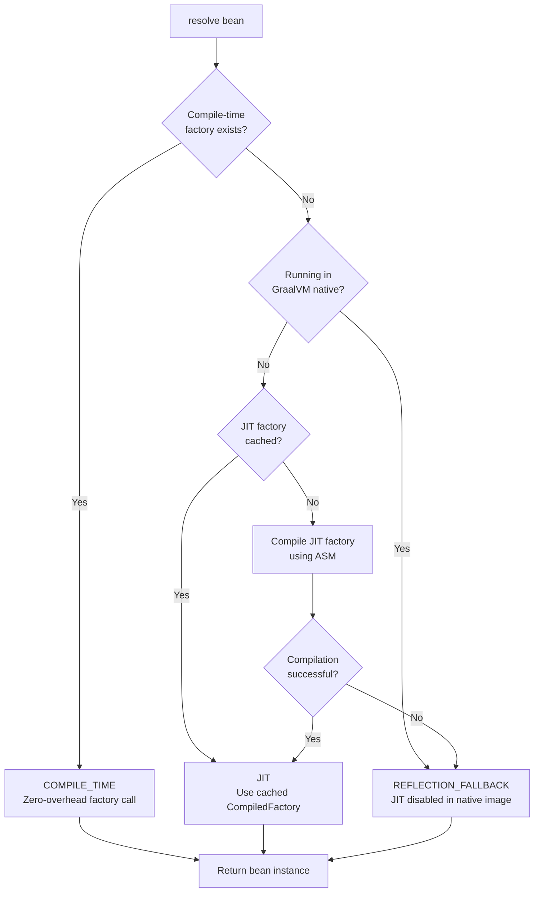
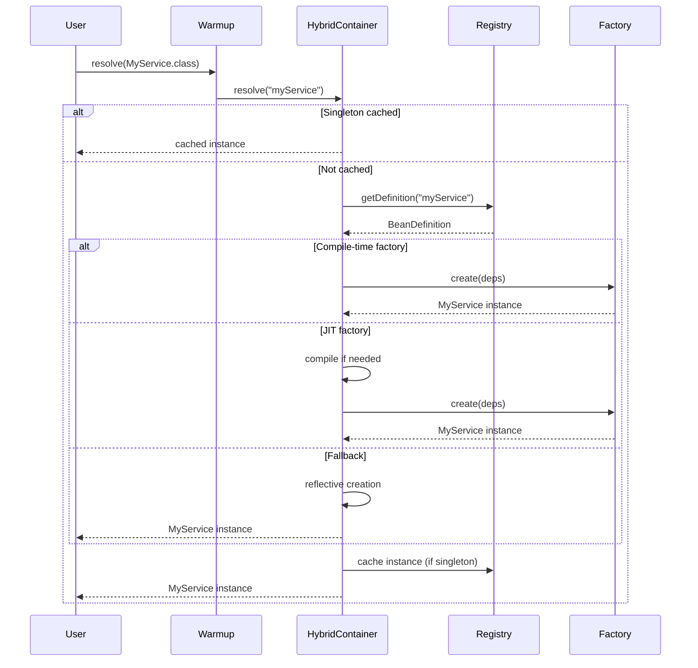

# Warmup Architecture

## Overview

Warmup is a hybrid dependency injection framework that combines compile-time code generation with runtime JIT compilation. This document describes the architecture, module structure, and resolution flow.

## Module Structure

```
warmup-parent/
├── warmup-annotations    # Core annotations (@Bean, @Inject, @PostConstruct, @PreDestroy)
├── warmup-core           # DI engine (Warmup, HybridContainer, BeanRegistry, DependencyGraph)
├── warmup-asm            # JIT compiler implementation using ASM 9.x
├── warmup-processor      # Annotation processor for compile-time factory generation
├── warmup-javafx         # Optional JavaFX integration (lazy controllers, hot-reload)
└── warmup-benchmarks     # JMH benchmarks comparing vs Avaje Inject
```

### Module Responsibilities

| Module | Responsibility |
|--------|----------------|
| `warmup-annotations` | Defines DI annotations: `@Bean`, `@Inject`, `@PostConstruct`, `@PreDestroy`. No dependencies on other modules. |
| `warmup-core` | Core container logic: `HybridContainer`, `BeanRegistry`, `DependencyGraph`, `JITCompiler` interface, `CompiledFactory` interface. Instantiates `AsmJITCompiler` directly for runtime bytecode generation. |
| `warmup-asm` | ASM-based JIT compiler implementation (`AsmJITCompiler`). Now embedded within `warmup-core` module. |
| `warmup-processor` | Compile-time annotation processor. Generates `XXX$$WarmupFactory` classes and `GeneratedFactoryRegistrar`. |
| `warmup-javafx` | JavaFX integration layer with lazy controller loading and FXML support. |
| `warmup-benchmarks` | JMH benchmarks for performance validation. |

## Resolution Paths

Warmup uses three resolution paths, checked in order:



### Path A: COMPILE_TIME

- **Trigger**: Bean annotated with `@Bean` and processed by annotation processor
- **Mechanism**: Pre-generated `XXX$$WarmupFactory` class implementing `CompiledFactory<T>`
- **Performance**: ~10-20ns per resolution (direct method call)
- **Registration**: Automatic via `META-INF/services/com.warmup.core.jit.FactoryRegistrar`

### Path B: JIT Runtime

- **Trigger**: Bean registered programmatically via `registerDynamic()` without compile-time factory
- **Mechanism**: ASM generates bytecode for factory class at runtime
- **Performance**: First call includes compilation time (~100-500μs), subsequent calls ~15-25ns
- **Caching**: Compiled factories cached in `jitFactoryCache` map

### Path C: REFLECTION_FALLBACK

- **Trigger**: No compile-time or JIT factory available, or running in GraalVM native image
- **Mechanism**: Reflective instantiation using `Constructor.newInstance()`
- **Performance**: ~100-200ns per resolution
- **Background**: Triggers async JIT compilation for future calls (unless in native image)

## Container Flow



## Key Classes

### `com.warmup.core.Warmup`

Main entry point providing ergonomic API:

```java
// Simple usage
Warmup warmup = Warmup.create();
MyService service = warmup.resolve(MyService.class);

// Advanced configuration
Warmup warmup = Warmup.builder()
    .diagnostic(true)
    .maxPendingCompilations(20)
    .build();
```

### `com.warmup.core.container.HybridContainer`

Core container implementation managing:

- Bean registry (`BeanRegistryImpl`)
- Dependency graph (`DependencyGraph`)
- Compile-time factories (`compileTimeFactories`)
- JIT factory cache (`jitFactoryCache`)
- Background warmup executor
- Metrics collection

### `com.warmup.core.jit.CompiledFactory<T>`

Functional interface for zero-overhead bean instantiation:

```java
@FunctionalInterface
public interface CompiledFactory<T> {
    T create(Object... dependencies);
    
    default Class<T> getBeanType() { return null; }
    default int getDependencyCount() { return 0; }
}
```

### `com.warmup.core.jit.JITCompiler`

Interface for runtime bytecode generation:

```java
public interface JITCompiler {
    <T> CompiledFactory<T> compile(Class<T> beanClass, Class<?>... dependencyClasses);
    <T> CompletableFuture<CompiledFactory<T>> compileAsync(...);
    boolean hasCompiledFactory(Class<?> beanClass);
    <T> Optional<CompiledFactory<T>> getCachedFactory(Class<T> beanClass);
    boolean unloadFactory(Class<?> beanClass);
    CompilationStats getStats();
    void clear();
}
```

### `com.warmup.asm.AsmJITCompiler`

ASM-based implementation generating bytecode:

```java
public class BeanType$$WarmupFactory implements CompiledFactory<BeanType> {
    public Object create(Object... dependencies) {
        return new BeanType(
            (DependencyType1) dependencies[0],
            (DependencyType2) dependencies[1]
        );
    }
    
    public Class<BeanType> getBeanType() { return BeanType.class; }
    public int getDependencyCount() { return 2; }
}
```

### `com.warmup.processor.WarmupProcessor`

Annotation processor generating:

1. `XXX$$WarmupFactory` - Factory class for each `@Bean`
2. `GeneratedFactoryRegistrar` - Aggregates all factories in module
3. `META-INF/services/com.warmup.core.jit.FactoryRegistrar` - ServiceLoader file

## Thread Safety

All container operations are thread-safe:

- `ConcurrentHashMap` for factory caches and registries
- `LongAdder` for metrics accumulation (better contention performance than `AtomicLong`)
- `Semaphore` for backpressure control in background warmup
- Lock-free resolution path for cached singletons

## Memory Management

- Custom `CustomClassLoader` per bean type enables class unloading
- `WeakReference` patterns allow GC of unused factories
- Call `unloadFactory()` to explicitly free metaspace
- `clear()` on shutdown releases all resources

## GraalVM Native Image Support

When running in GraalVM native image:

- `IS_NATIVE_IMAGE` flag detected via reflection on `org.graalvm.nativeimage.ImageInfo`
- JIT compilation automatically disabled (no dynamic bytecode generation)
- Falls back to compile-time factories only
- Reflection fallback used if no compile-time factory exists

```java
private static final boolean IS_NATIVE_IMAGE = computeNativeImage();

// In createBean():
if (nativeImage && compileTimeFactory == null) {
    // Skip JIT, use reflection
    return createViaReflection(definition);
}
```

## See Also

- [Getting Started](getting-started.md) - Installation and basic usage
- [Annotations Reference](annotations.md) - Detailed annotation documentation
- [Compile-Time Processing](compile-time-processing.md) - How the annotation processor works
- [JIT Compilation](jit-compilation.md) - ASM bytecode generation details
- [Scopes and Lifecycle](scopes-and-lifecycle.md) - SINGLETON vs PROTOTYPE, callbacks
- [GraalVM Native](graalvm-native.md) - Native image configuration
- [Benchmarks](benchmarks.md) - Performance comparison with Avaje Inject
