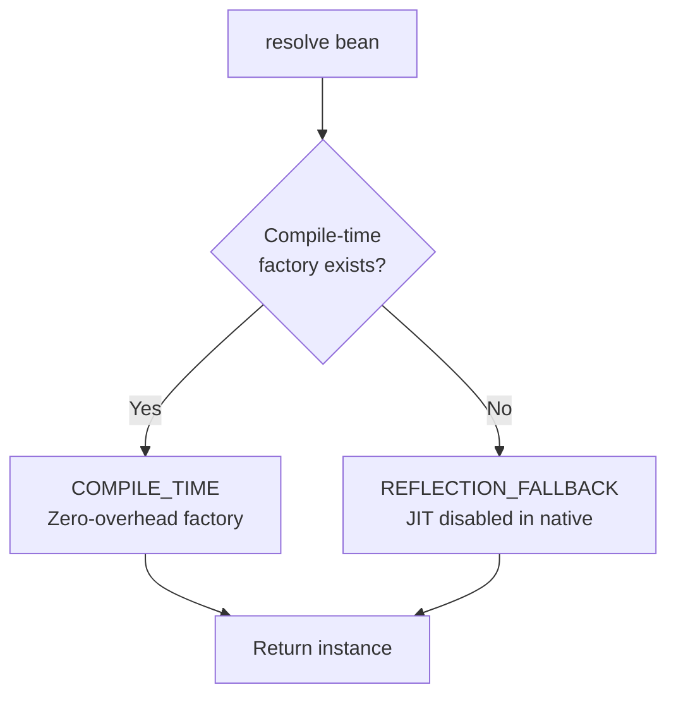

# GraalVM Native Image Support

This document explains how Warmup supports GraalVM native image compilation and the considerations for running in native mode.

## Overview

Warmup automatically detects when running in a GraalVM native image and adapts its behavior:

- **JIT compilation disabled**: No dynamic bytecode generation
- **Compile-time factories only**: Uses pre-generated `XXX$$WarmupFactory` classes
- **Reflection fallback**: Used when no compile-time factory exists

## Detection Mechanism

### IS_NATIVE_IMAGE Flag

The container detects native image mode at startup:

```java
public class HybridContainer {
    
    private static final boolean IS_NATIVE_IMAGE = computeNativeImage();
    
    private static boolean computeNativeImage() {
        try {
            Class<?> imageInfoClass = Class.forName("org.graalvm.nativeimage.ImageInfo");
            Object inImageCode = imageInfoClass.getMethod("inImageCode").invoke(null);
            return Boolean.TRUE.equals(inImageCode);
        } catch (ReflectiveOperationException e) {
            // Not running in GraalVM or ImageInfo not available
            return false;
        }
    }
}
```

### Runtime Behavior

When `IS_NATIVE_IMAGE` is true:

```java
// In createBean():
if (nativeImage && compileTimeFactory == null) {
    // Skip JIT, use reflection
    path = ResolutionDiagnostic.ResolutionPath.REFLECTION_FALLBACK;
    fallbackCount.add(1);
    return createViaReflection(definition);
}
```

**Resolution path flow in native image:**



## Building Native Images

### Prerequisites

1. **GraalVM JDK 17+** installed
2. **native-image** tool available
3. All dependencies compatible with native image

### Installation

```bash
# Install GraalVM (example using sdkman)
sdk install java 21.0.2-graalce
sdk use java 21.0.2-graalce

# Verify native-image is available
native-image --version
```

### Maven Configuration

Add the GraalVM Maven plugin:

```xml
<build>
    <plugins>
        <plugin>
            <groupId>org.graalvm.buildtools</groupId>
            <artifactId>native-maven-plugin</artifactId>
            <version>0.10.0</version>
            <extensions>true</extensions>
            <executions>
                <execution>
                    <id>build-native</id>
                    <goals>
                        <goal>compile-no-fork</goal>
                    </goals>
                    <phase>package</phase>
                </execution>
            </executions>
            <configuration>
                <imageName>${project.artifactId}</imageName>
                <buildArgs>
                    <arg>--initialize-at-build-time=com.warmup</arg>
                    <arg>--report-unsupported-elements-at-runtime</arg>
                </buildArgs>
            </configuration>
        </plugin>
    </plugins>
</build>
```

### Build Command

```bash
# Build native image
mvn -Pnative clean package

# Or using native-image directly
native-image -cp target/warmup-core-1.0.0-SNAPSHOT.jar \
             --initialize-at-build-time=com.warmup \
             -H:+ReportUnsupportedElementsAtRuntime \
             warmup-app
```

## Required Reflection Configuration

For beans without compile-time factories, reflection is used. Add configuration:

### reflect-config.json

```json
[
  {
    "name": "com.example.MyService",
    "allDeclaredConstructors": true,
    "allPublicConstructors": true
  },
  {
    "name": "com.example.MyRepository",
    "allDeclaredConstructors": true,
    "allPublicConstructors": true
  }
]
```

### resource-config.json

Include ServiceLoader files:

```json
{
  "resources": [
    {
      "pattern": "META-INF/services/com.warmup.core.jit.FactoryRegistrar"
    },
    {
      "pattern": "META-INF/services/java.lang.System$LoggerFinder"
    }
  ]
}
```

### Pass to native-image

```bash
native-image ... \
  -H:ReflectionConfigurationResources=reflect-config.json \
  -H:ResourceConfigurationResources=resource-config.json
```

## Compile-Time Factories (Recommended)

For best native image performance, use annotation processing:

### Maven Setup

```xml
<build>
    <plugins>
        <plugin>
            <groupId>org.apache.maven.plugins</groupId>
            <artifactId>maven-compiler-plugin</artifactId>
            <version>3.11.0</version>
            <configuration>
                <annotationProcessorPaths>
                    <path>
                        <groupId>com.warmup</groupId>
                        <artifactId>warmup-processor</artifactId>
                        <version>1.0.0-SNAPSHOT</version>
                    </path>
                </annotationProcessorPaths>
            </configuration>
        </plugin>
    </plugins>
</build>
```

### Benefits

- **Zero reflection overhead** for annotated beans
- **Faster startup** (no runtime compilation)
- **Smaller image size** (no ASM dependency needed at runtime)
- **Type-safe** resolution

## Performance Comparison

### Startup Time

| Configuration | Startup Time |
|---------------|--------------|
| JVM (compile-time) | ~5-10 ms |
| JVM (JIT warmup) | ~50-100 ms |
| Native (compile-time) | ~1-3 ms |
| Native (reflection) | ~5-15 ms |

### Memory Usage

| Configuration | Heap Usage |
|---------------|------------|
| JVM (100 beans) | ~50-100 MB |
| Native (100 beans) | ~10-20 MB |

### Resolution Performance

| Path | Resolution Time |
|------|-----------------|
| COMPILE_TIME (native) | ~10-20 ns |
| REFLECTION (native) | ~100-200 ns |
| JIT (JVM only) | ~15-25 ns |

## Limitations

### No JIT Compilation

Dynamic bytecode generation is impossible in native images:

```java
// This will NOT work in native image
jitCompiler.compile(MyBean.class);  // Skipped, falls back to reflection
```

**Solution:** Use `@Bean` annotation for all critical beans.

### Reflection Overhead

Beans without compile-time factories use reflection:

- Slower resolution (~10x slower than compile-time)
- Requires reflection configuration
- Larger image size (metadata included)

### Class Unloading Disabled

Custom ClassLoaders for JIT don't apply:

```java
// Class unloading not relevant in native image
jitCompiler.unloadFactory(MyBean.class);  // No-op
```

## Best Practices

### For Native Image Targets

**Do:**

- Annotate ALL beans with `@Bean`
- Generate compile-time factories
- Test native build early and often
- Use minimal reflection configuration
- Profile image size and startup time

**Don't:**

- Rely on JIT compilation
- Use `registerDynamic()` for core beans
- Assume JVM behavior matches native
- Skip reflection configuration testing

### Hybrid Approach

Support both JVM and native:

```java
@Bean  // Works in both JVM and native
public class CoreService { }

// Dynamic registration (JVM only, gracefully degrades in native)
if (!isNativeImage()) {
    container.registerDynamic(pluginDefinition);
}
```

### Testing

Test both modes:

```bash
# JVM mode
mvn test

# Native mode
mvn -Pnative test

# Compare results
diff jvm-results.txt native-results.txt
```

## Troubleshooting

### Missing Compile-Time Factory

**Error:** Bean resolution slow, using reflection

**Solution:** Ensure `@Bean` annotation and processor configured:

```xml
<dependency>
    <groupId>com.warmup</groupId>
    <artifactId>warmup-processor</artifactId>
    <scope>provided</scope>
</dependency>
```

### Reflection Configuration Missing

**Error:** `org.graalvm.nativeimage.MissingReflectionRegistrationException`

**Solution:** Add to `reflect-config.json`:

```json
{
  "name": "com.example.MyBean",
  "allDeclaredConstructors": true
}
```

### ServiceLoader Not Working

**Error:** No factories discovered at startup

**Solution:** Add to `resource-config.json`:

```json
{
  "pattern": "META-INF/services/com.warmup.core.jit.FactoryRegistrar"
}
```

### Image Too Large

**Symptoms:** Binary size > expected

**Solutions:**

1. Remove unused dependencies
2. Use compile-time factories (reduces ASM need)
3. Enable optimization flags:
   ```bash
   native-image ... -O3 -march=native
   ```

## Example: Complete Native Setup

### pom.xml

```xml
<project>
    <dependencies>
        <dependency>
            <groupId>com.warmup</groupId>
            <artifactId>warmup-core</artifactId>
            <version>1.0.0-SNAPSHOT</version>
        </dependency>
        <dependency>
            <groupId>com.warmup</groupId>
            <artifactId>warmup-annotations</artifactId>
            <version>1.0.0-SNAPSHOT</version>
        </dependency>
    </dependencies>
    
    <build>
        <plugins>
            <!-- Annotation processor -->
            <plugin>
                <groupId>org.apache.maven.plugins</groupId>
                <artifactId>maven-compiler-plugin</artifactId>
                <configuration>
                    <annotationProcessorPaths>
                        <path>
                            <groupId>com.warmup</groupId>
                            <artifactId>warmup-processor</artifactId>
                            <version>1.0.0-SNAPSHOT</version>
                        </path>
                    </annotationProcessorPaths>
                </configuration>
            </plugin>
            
            <!-- Native image -->
            <plugin>
                <groupId>org.graalvm.buildtools</groupId>
                <artifactId>native-maven-plugin</artifactId>
                <version>0.10.0</version>
                <executions>
                    <execution>
                        <id>build-native</id>
                        <goals>
                            <goal>compile-no-fork</goal>
                        </goals>
                        <phase>package</phase>
                    </execution>
                </executions>
            </plugin>
        </plugins>
    </build>
</project>
```

### Application Code

```java
import com.warmup.annotations.Bean;
import com.warmup.core.Warmup;

@Bean
public class GreetingService {
    public String greet(String name) {
        return "Hello, " + name;
    }
}

public class Main {
    public static void main(String[] args) {
        try (Warmup warmup = Warmup.create()) {
            GreetingService service = warmup.resolve(GreetingService.class);
            System.out.println(service.greet("World"));
        }
    }
}
```

### Build and Run

```bash
# Build JAR
mvn package

# Build native image
mvn -Pnative package

# Run native executable
./target/warmup-app

# Compare with JVM
java -jar target/warmup-app.jar
```

## See Also

- [Architecture](architecture.md) - Overall system design
- [Compile-Time Processing](compile-time-processing.md) - Factory generation
- [Benchmarks](benchmarks.md) - Performance comparison
