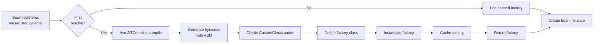

# JIT Compilation

This document explains how Warmup performs runtime bytecode generation using ASM for dynamically registered beans.

## Overview

The `AsmJITCompiler` is the runtime bytecode generation engine that:

1. Analyzes bean class constructors at runtime
2. Generates `CompiledFactory` bytecode using ASM 9.x
3. Loads generated classes via custom `ClassLoader`
4. Caches compiled factories to avoid recompilation
5. Supports class unloading to prevent metaspace leaks

## Architecture



## AsmJITCompiler

### Interface Implementation

```java
public class AsmJITCompiler implements JITCompiler {
    
    // Factory cache: bean class -> compiled factory
    private final ConcurrentHashMap<Class<?>, CompiledFactory<?>> factoryCache 
        = new ConcurrentHashMap<>();
    
    // Pending compilations for async tracking
    private final ConcurrentHashMap<Class<?>, CompletableFuture<CompiledFactory<?>>> 
        pendingCompilations = new ConcurrentHashMap<>();
    
    // ClassLoader references for unloading
    private final ConcurrentHashMap<Class<?>, CustomClassLoader> classLoaders 
        = new ConcurrentHashMap<>();
    
    // Statistics
    private final AtomicLong totalCompilations = new AtomicLong(0);
    private final AtomicLong successfulCompilations = new AtomicLong(0);
    private final AtomicLong failedCompilations = new AtomicLong(0);
    private final AtomicLong totalCompilationTimeNs = new AtomicLong(0);
}
```

### Core Methods

#### `compile(Class<T>, Class<?>...)`

Synchronous compilation:

```java
<T> CompiledFactory<T> compile(Class<T> beanClass, Class<?>... dependencyClasses)
    throws CompilationException
```

**Process:**

1. Check cache for existing factory
2. Generate bytecode using ASM
3. Create custom ClassLoader
4. Define and instantiate factory class
5. Cache factory and ClassLoader
6. Return factory

**Example:**

```java
JITCompiler compiler = new AsmJITCompiler();

CompiledFactory<MyService> factory = compiler.compile(
    MyService.class,
    UserRepository.class  // Dependency types
);

MyService service = factory.create(repositoryInstance);
```

#### `compileAsync(Class<T>, Class<?>...)`

Asynchronous compilation for background warmup:

```java
<T> CompletableFuture<CompiledFactory<T>> compileAsync(
    Class<T> beanClass, 
    Class<?>... dependencyClasses
)
```

**Features:**

- Returns immediately with `CompletableFuture`
- Deduplicates concurrent compilations of same bean
- Completes future when compilation finishes

```java
CompletableFuture<CompiledFactory<MyService>> future = 
    compiler.compileAsync(MyService.class, UserRepository.class);

future.thenAccept(factory -> {
    MyService service = factory.create(repositoryInstance);
});
```

#### `unloadFactory(Class<?>)`

Explicit class unloading:

```java
boolean unloadFactory(Class<?> beanClass)
```

**Process:**

1. Remove factory from cache
2. Remove ClassLoader reference
3. Call `ClassLoader.unload()` to allow GC

## Bytecode Generation

### Generated Factory Structure

For a bean like:

```java
public class UserService {
    public UserService(UserRepository repo, Logger logger) {
        // Constructor
    }
}
```

The generated factory bytecode is equivalent to:

```java
public class UserService$$WarmupFactory implements CompiledFactory<UserService> {
    
    public UserService$$WarmupFactory() {
        super();
    }
    
    @Override
    public Object create(Object... dependencies) {
        return new UserService(
            (UserRepository) dependencies[0],
            (Logger) dependencies[1]
        );
    }
    
    @Override
    public Class<UserService> getBeanType() {
        return UserService.class;
    }
    
    @Override
    public int getDependencyCount() {
        return 2;
    }
}
```

### ASM Implementation

```java
public <T> byte[] generateFactoryBytecode(Class<T> beanClass, Class<?>[] dependencyClasses) {
    ClassWriter cw = new ClassWriter(ClassWriter.COMPUTE_FRAMES);
    
    String className = beanClass.getName().replace('.', '/') + "$$WarmupFactory";
    String interfaceName = Type.getInternalName(CompiledFactory.class);
    String beanInternalName = Type.getInternalName(beanClass);
    
    // Class declaration
    cw.visit(Opcodes.V17, Opcodes.ACC_PUBLIC | Opcodes.ACC_FINAL, className, null, 
             "java/lang/Object", new String[]{interfaceName});
    
    // Default constructor
    MethodVisitor ctor = cw.visitMethod(Opcodes.ACC_PUBLIC, "<init>", "()V", null, null);
    ctor.visitCode();
    ctor.visitVarInsn(Opcodes.ALOAD, 0);
    ctor.visitMethodInsn(Opcodes.INVOKESPECIAL, "java/lang/Object", "<init>", "()V", false);
    ctor.visitInsn(Opcodes.RETURN);
    ctor.visitMaxs(1, 1);
    ctor.visitEnd();
    
    // create(Object...) method
    MethodVisitor mv = cw.visitMethod(Opcodes.ACC_PUBLIC, "create", 
                                      "([Ljava/lang/Object;)Ljava/lang/Object;", 
                                      null, null);
    mv.visitCode();
    
    // NEW beanType
    mv.visitTypeInsn(Opcodes.NEW, beanInternalName);
    mv.visitInsn(Opcodes.DUP);
    
    // Push constructor arguments
    for (int i = 0; i < dependencyClasses.length; i++) {
        mv.visitVarInsn(Opcodes.ALOAD, 1);  // Load dependencies array
        mv.visitLdcInsn(i);                  // Push index
        mv.visitInsn(Opcodes.AALOAD);        // Load dependencies[i]
        
        String depInternalName = Type.getInternalName(dependencyClasses[i]);
        mv.visitTypeInsn(Opcodes.CHECKCAST, depInternalName);  // Cast
    }
    
    // Invoke constructor
    String constructorDescriptor = Type.getMethodDescriptor(
        Type.VOID_TYPE, 
        Arrays.stream(dependencyClasses).map(Type::getType).toArray(Type[]::new)
    );
    mv.visitMethodInsn(Opcodes.INVOKESPECIAL, beanInternalName, "<init>", 
                       constructorDescriptor, false);
    
    mv.visitInsn(Opcodes.ARETURN);  // Return created instance
    mv.visitMaxs(2 + dependencyClasses.length, 2 + dependencyClasses.length);
    mv.visitEnd();
    
    // getBeanType() method
    mv = cw.visitMethod(Opcodes.ACC_PUBLIC, "getBeanType", 
                        "()Ljava/lang/Class;", "()Ljava/lang/Class<T>;", null);
    mv.visitCode();
    mv.visitLdcInsn(Type.getType("L" + beanInternalName + ";"));
    mv.visitInsn(Opcodes.ARETURN);
    mv.visitMaxs(1, 1);
    mv.visitEnd();
    
    // getDependencyCount() method
    mv = cw.visitMethod(Opcodes.ACC_PUBLIC, "getDependencyCount", "()I", null, null);
    mv.visitCode();
    mv.visitLdcInsn(dependencyClasses.length);
    mv.visitInsn(Opcodes.IRETURN);
    mv.visitMaxs(1, 1);
    mv.visitEnd();
    
    cw.visitEnd();
    return cw.toByteArray();
}
```

## Custom ClassLoader

### Design

Each bean type gets its own `CustomClassLoader`:

```java
private static class CustomClassLoader extends ClassLoader {
    
    private volatile boolean unloaded = false;
    
    CustomClassLoader(Class<?> beanClass) {
        // Use bean's ClassLoader as parent for visibility
        super(beanClass.getClassLoader());
    }
    
    Class<?> defineClass(String name, byte[] bytecode) {
        return defineClass(name, bytecode, 0, bytecode.length);
    }
    
    void unload() {
        unloaded = true;
        // Clear any internal caches if needed
    }
}
```

### Why Per-Bean ClassLoaders?

**Pros:**

- Enables individual class unloading
- Isolates generated classes per bean
- Allows selective memory reclamation

**Cons:**

- Memory overhead (one ClassLoader per bean)
- More objects in heap

**Trade-off:** Acceptable for typical applications (< 1000 dynamically compiled beans). For high-scale scenarios, consider compile-time factories only.

### Unloading Process

```java
@Override
public boolean unloadFactory(Class<?> beanClass) {
    CompiledFactory<?> removed = factoryCache.remove(beanClass);
    CustomClassLoader classLoader = classLoaders.remove(beanClass);
    
    if (classLoader != null) {
        classLoader.unload();  // Marks as unloaded, allows GC
        return true;
    }
    
    return removed != null;
}
```

**Note:** Actual unloading happens when:

1. ClassLoader reference is removed
2. No live instances of generated classes exist
3. GC runs and detects unloadable classes
4. JVM unloads native code (if applicable)

## Caching Strategy

### Three-Level Cache

```
L1: Compile-time factories (compileTimeFactories map)
    ↓ (miss)
L2: JIT-compiled factories (jitFactoryCache / factoryCache map)
    ↓ (miss)
L3: Pending compilations (pendingCompilations map)
    ↓ (miss)
REFLECTION_FALLBACK
```

### Cache Operations

```java
// Check cache first
CompiledFactory<T> cached = (CompiledFactory<T>) factoryCache.get(beanClass);
if (cached != null) {
    return cached;  // L2 hit
}

// Compile and cache
CompiledFactory<T> factory = jitCompiler.compile(beanClass, depClasses);
factoryCache.put(beanClass, factory);
return factory;
```

### Thread Safety

All caches use `ConcurrentHashMap`:

- Lock-free reads for hot path
- Thread-safe writes for compilation
- No explicit synchronization needed

## Performance Characteristics

### Compilation Time

| Bean Complexity | Compilation Time |
|-----------------|------------------|
| No dependencies | ~50-100 μs |
| 1-3 dependencies | ~100-200 μs |
| 5+ dependencies | ~200-500 μs |

### Resolution Time (after compilation)

| Path | Resolution Time |
|------|-----------------|
| Compile-time factory | ~10-20 ns |
| JIT-compiled factory | ~15-25 ns |
| Reflection fallback | ~100-200 ns |

### Memory Overhead

| Component | Memory Usage |
|-----------|--------------|
| Factory class (~500 bytes) | ~1 KB per bean |
| CustomClassLoader | ~2-5 KB per bean |
| Cached factory instance | Negligible |

**Total:** ~3-6 KB per dynamically compiled bean

## Integration with HybridContainer

### Automatic JIT Compilation

When a bean is resolved without a compile-time factory:

```java
// In HybridContainer.createBean()
CompiledFactory<T> factory = (CompiledFactory<T>) compileTimeFactories.get(name);
if (factory != null) {
    // Path A: Compile-time
    compileTimeHits.add(1);
} else {
    // Check JIT cache
    factory = (CompiledFactory<T>) jitFactoryCache.get(name);
    if (factory != null) {
        // Path B: JIT cached
        jitHits.add(1);
    } else {
        // Compile JIT
        try {
            factory = jitCompiler.compile(definition.type(), getDependencyClasses(definition));
            jitFactoryCache.put(name, factory);
            jitHits.add(1);
        } catch (CompilationException e) {
            // Fallback to reflection
            fallbackCount.add(1);
            return createViaReflection(definition);
        }
    }
}
```

### Background Warmup

Beans registered via `registerDynamic()` trigger async compilation:

```java
public <T> void registerDynamic(BeanDefinition<T> definition) {
    registry.register(definition);
    
    // Trigger background warmup
    triggerBackgroundWarmup(definition);
}

private void triggerBackgroundWarmup(BeanDefinition<?> definition) {
    warmupExecutor.submit(() -> {
        warmupSemaphore.acquire();
        try {
            jitCompiler.compileAsync(definition.type(), getDependencyClasses(definition));
        } finally {
            warmupSemaphore.release();
        }
    });
}
```

## GraalVM Native Image

JIT compilation is **disabled** in GraalVM native images:

```java
private static final boolean IS_NATIVE_IMAGE = computeNativeImage();

// In createBean():
if (nativeImage && compileTimeFactory == null) {
    // Skip JIT, use reflection
    return createViaReflection(definition);
}
```

**Reason:** Native images don't support dynamic class loading or bytecode generation.

**Solution:** Use compile-time factories exclusively for native images.

## Error Handling

### CompilationException

Thrown when bytecode generation fails:

```java
public class CompilationException extends RuntimeException {
    public CompilationException(String message, Throwable cause) {
        super(message, cause);
    }
}
```

**Common causes:**

- Invalid constructor signature
- Missing dependency types
- ASM version mismatch
- Class access violations

### Fallback Mechanism

If JIT compilation fails, falls back to reflection:

```java
try {
    factory = jitCompiler.compile(definition.type(), getDependencyClasses(definition));
} catch (CompilationException e) {
    fallbackCount.add(1);
    return createViaReflection(definition);
}
```

## Best Practices

### When to Use JIT

**Good candidates:**

- Dynamically loaded plugins
- Runtime-generated configurations
- Testing/mocking scenarios
- Prototypes during development

**Poor candidates:**

- Core application beans (use `@Bean` instead)
- High-frequency resolution paths
- GraalVM native image targets

### Optimization Tips

1. **Pre-warm critical beans:**
   ```java
   container.warmupAsync(CriticalService.class);
   ```

2. **Monitor compilation stats:**
   ```java
   CompilationStats stats = container.getCompilationStats();
   if (stats.failedCompilations() > 0) {
       // Investigate failures
   }
   ```

3. **Unload unused factories:**
   ```java
   container.shutdown();  // Unloads all
   // Or individually:
   jitCompiler.unloadFactory(OldBean.class);
   ```

## See Also

- [Architecture](architecture.md) - Overall system design
- [Compile-Time Processing](compile-time-processing.md) - Alternative to JIT
- [GraalVM Native](graalvm-native.md) - Native image considerations
